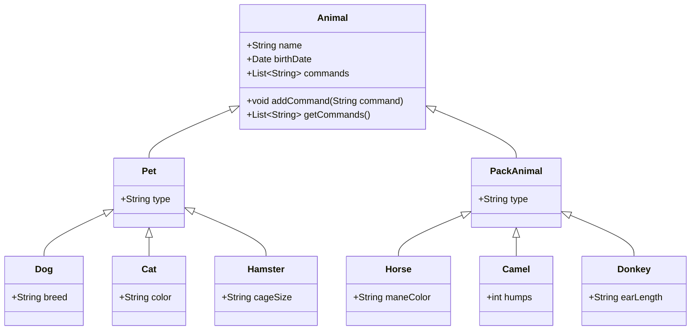

# java-project

### Это комплексный проект, который охватывает несколько областей: работу с Linux, базами данных MySQL и программирование на Java. Для начала разберемся с каждым пунктом задания.

Давайте начнем с создания диаграммы классов, так как это поможет нам лучше понять структуру проекта и послужит основой для дальнейшей работы.



Эта диаграмма классов отражает иерархию животных в питомнике. У нас есть базовый класс `Animal`, от которого наследуются классы `Pet` и `PackAnimal`. Далее, от `Pet` наследуются `Dog`, `Cat` и `Hamster`, а от `PackAnimal` - `Horse`, `Camel` и `Donkey`.


Теперь давайте рассмотрим каждый пункт задания:

1. Использование команды cat в Linux:

```bash
# Создание файла Pets
cat > Pets.txt << EOF
Dogs
Cats
Hamsters
EOF

# Создание файла Pack animals
cat > PackAnimals.txt << EOF
Horses
Camels
Donkeys
EOF

# Объединение файлов
cat Pets.txt PackAnimals.txt > HumanFriends.txt

# Просмотр содержимого
cat HumanFriends.txt

# Переименование файла
mv HumanFriends.txt HumanFriends.txt
```

2. Работа с директориями в Linux:

```bash
# Создание новой директории
mkdir AnimalRegistry

# Перемещение файла
mv HumanFriends.txt AnimalRegistry/
```

3. Работа с MySQL в Linux:

```bash
# Добавление репозитория MySQL
sudo apt-get update
sudo apt-get install mysql-server
```

4. Управление deb-пакетами:

```bash
# Скачивание deb-пакета (пример с htop)
wget http://archive.ubuntu.com/ubuntu/pool/main/h/htop/htop_3.0.5-7_amd64.deb

# Установка пакета
sudo dpkg -i htop_3.0.5-7_amd64.deb

# Удаление пакета
sudo dpkg -r htop
```

5. История команд в терминале Ubuntu:Вы можете сохранить историю команд, выполнив:

```bash
history > command_history.txt
```

### 7 Работа в MYSQL и скрипт для выполнения запросов находиться в папке SQL

### 8,9. Программа-реестр домашних животных выполнен в папке PetRegistry


